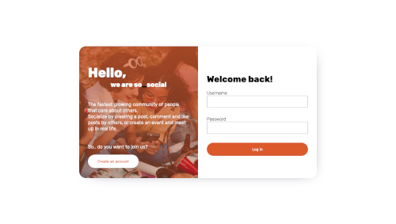

[![LinkedIn][linkedin-shield]][linkedin-url]

<h3 align="center">so_social</h3>

  

    Front-end part of social media app
     
     
    <a href="https://so-social.netlify.app">View Demo</a>
    ·
    <a href="https://github.com/malgo-slota/social-media-app/issues">Report Bug</a>
  

  

    
  

<!-- TABLE OF CONTENTS -->

  
Table of Contents

  <ol>
    <li>
      <a href="#about-the-project">About The Project</a>
      <ul>
        <li><a href="#built-with">Built With</a></li>
      </ul>
    </li>
    <li><a href="#usage">Usage</a></li>
    <li><a href="#continued-development">Continued development</a></li>
    <li><a href="#contact">Contact</a></li>
  </ol>

<!-- ABOUT THE PROJECT -->
## About The Project

This project contains only front-end part, backend is in progress in seperate repository.
Responsive web application builded with mobile first approach. Created to develop skills in CSS preprocessor SASS, and recap React.js knowledge by building the project with determined deadline of 2 weeks (besides working on this README file it was fulfilled).

(<a href="#readme-top">back to top</a>)

### Built With

(<a href="#readme-top">back to top</a>)

<!-- USAGE EXAMPLES -->
## Usage

- view the login and register page
- view user profile page
- view main page
- add a new post and create an new event form
- like and save post demo
- drop down comments section, add a new comment form
- default light theme and switch to dark option (choice remembered when user re-visits)

(<a href="#readme-top">back to top</a>)

<!-- ROADMAP -->
## Continued development

- Back-end part that will provide: adding/deleting posts, creating events, follow/unfollow users, sending messages, login/logout and register, comment on posts of others, save/like function, update user information etc.

(<a href="#readme-top">back to top</a>)

<!-- CONTACT -->
## Contact

- LinkedIn - [Małgorzata Słota](https://www.linkedin.com/in/malgorzata-slota/)

(<a href="#readme-top">back to top</a>)

## Acknowledgements

- Medium article by Katie McTigue- [How to Create a Dark Mode in Sass](https://medium.com/@katiemctigue/how-to-create-a-dark-mode-in-sass-609f131a3995)

(<a href="#readme-top">back to top</a>)

[linkedin-shield]: https://img.shields.io/badge/-LinkedIn-black.svg?style=for-the-badge&logo=linkedin&colorB=555
[linkedin-url]: https://linkedin.com/in/othneildrew
